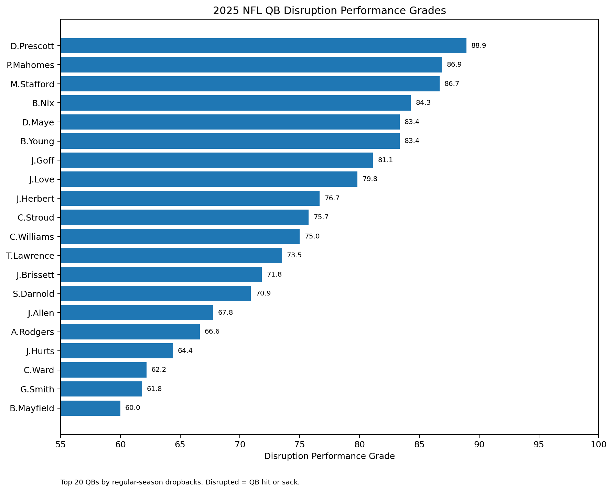
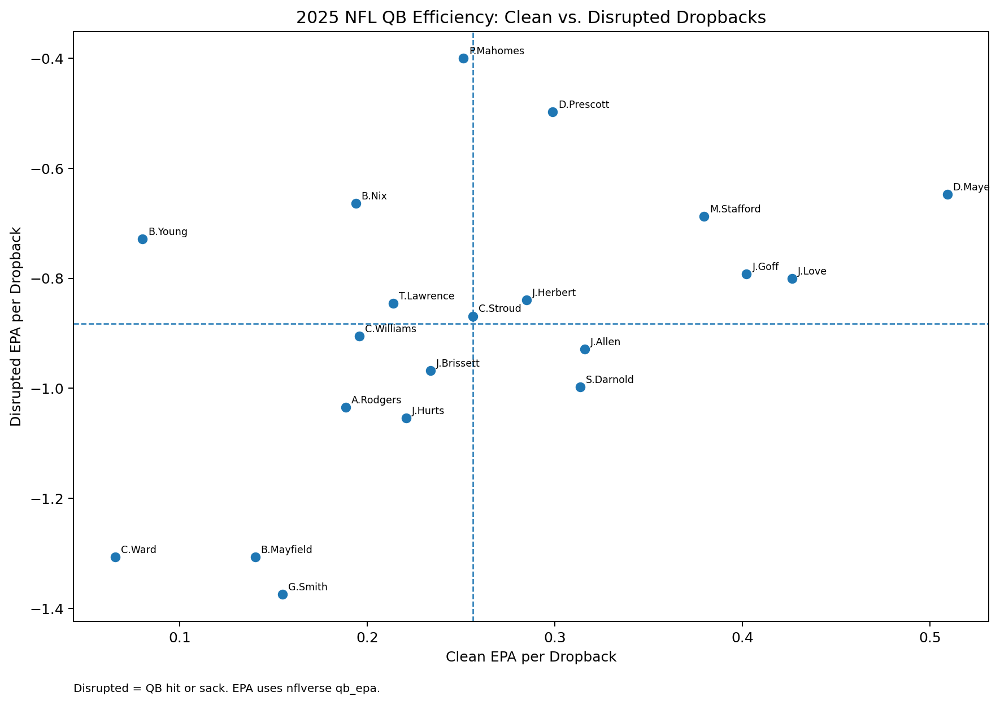

# 2025 NFL QB Performance Under Disruption

This is my second independent sports analytics project.

My first project looked at overall passing efficiency. For this one, I wanted to get closer to play-by-play analysis and ask a more specific question:

**Which high-volume quarterbacks handled disrupted dropbacks best during the 2025 regular season?**

## What I did

I used 2025 regular-season play-by-play data from nflverse and selected the 20 quarterbacks with the most dropbacks.

I defined a **disrupted dropback** as a play where nflverse marked the quarterback as hit or sacked. I intentionally use the word *disruption* instead of *pressure* because this is not a complete tracking-data measure of every pressure.

For each quarterback, I looked at:

- EPA per dropback when disrupted — 50%
- Positive EPA rate when disrupted — 20%
- Sack rate on disrupted dropbacks — 20%
- Turnover rate on disrupted dropbacks — 10%

Lower sack and turnover rates are better.

I also calculated clean-pocket EPA and disruption rate for context, but I did **not** put disruption rate into the grade because offensive line play, scheme and situation can strongly affect how often a quarterback gets hit.

## Results

| Rank | Quarterback | Team | Grade | Disrupted EPA/DB | Disrupted DBs |
| ---: | --- | --- | ---: | ---: | ---: |
| 1 | D.Prescott | DAL | 88.9 | -0.498 | 95 |
| 2 | P.Mahomes | KC | 86.9 | -0.400 | 102 |
| 3 | M.Stafford | LA | 86.7 | -0.687 | 78 |
| 4 | B.Nix | DEN | 84.3 | -0.664 | 71 |
| 5 | D.Maye | NE | 83.4 | -0.648 | 94 |
| 6 | B.Young | CAR | 83.4 | -0.728 | 77 |
| 7 | J.Goff | DET | 81.1 | -0.793 | 117 |
| 8 | J.Love | GB | 79.8 | -0.800 | 70 |
| 9 | J.Herbert | LAC | 76.7 | -0.840 | 129 |
| 10 | C.Stroud | HOU | 75.7 | -0.869 | 59 |
| 11 | C.Williams | CHI | 75.0 | -0.905 | 67 |
| 12 | T.Lawrence | JAX | 73.5 | -0.846 | 85 |
| 13 | J.Brissett | ARI | 71.8 | -0.968 | 106 |
| 14 | S.Darnold | SEA | 70.9 | -0.997 | 63 |
| 15 | J.Allen | BUF | 67.8 | -0.929 | 71 |
| 16 | A.Rodgers | PIT | 66.6 | -1.034 | 58 |
| 17 | J.Hurts | PHI | 64.4 | -1.054 | 57 |
| 18 | C.Ward | TEN | 62.2 | -1.306 | 108 |
| 19 | G.Smith | LV | 61.8 | -1.374 | 99 |
| 20 | B.Mayfield | TB | 60.0 | -1.307 | 56 |

## Disruption Performance Grades

## Clean vs. Disrupted EPA

Every quarterback in the sample became less efficient when the play was disrupted. The interesting part was how much the results changed from player to player.

## What surprised me

Dak Prescott finished first in this version of the model. Patrick Mahomes also moved much higher than he did in my first passing-efficiency project. That was interesting because it showed me how much a ranking can change when the question changes.

Drake Maye was another result I wanted to look at more closely. His clean-dropback EPA was excellent and he still produced relatively well when disrupted, but sacks were a bigger issue.

Josh Allen and Jalen Hurts are good examples of a limitation in this project. A dropback-based model does not fully capture what they can add as runners, so I would not use these grades as total quarterback grades.

## What I learned

The biggest thing I learned from this project is that the definition of a metric matters almost as much as the calculation.

At first, it would have been easy to call every QB hit or sack a "pressure." Once I looked more closely at the data, I realized that would overstate what the dataset actually tells me. I decided to call these plays disrupted dropbacks instead.

I also learned that changing the question can completely change how a player looks. This model is not asking who the best quarterback is. It is asking who had the best results on the specific disrupted plays available in this dataset.

## Limitations

This is not a full pressure-tracking model. A quarterback can be pressured without being recorded as hit or sacked.

The model also does not fully control for offensive line quality, receiver separation, scheme, time to throw, opponent strength, down and distance, or game situation.

Sacks are complicated because responsibility can belong to the quarterback, protection, receivers, play design, or some combination of them.

This is a one-season sample and should not be treated as a permanent quarterback talent grade.

## What I would add next

A stronger version would use true pressure data if available, separate avoidable and unavoidable sacks, add time to throw and depth of target, control for down and distance, and include quarterback rushing value.

I would also like to compare the model across multiple seasons to see which disruption results are actually stable from year to year.

## Files

- `analysis.py` — readable Python version of the analysis and grading model
- `data/play_by_play_2025.csv.gz` — nflverse source data used in the project
- `results/qb_disruption_rankings.csv` — final rankings and underlying metrics
- `results/houstons_take.csv` — my notes on each quarterback's result
- `charts/2025_qb_disruption_performance_grades.png` — grade visualization
- `charts/2025_qb_clean_vs_disrupted_epa.png` — clean vs. disrupted efficiency comparison

## Data source

nflverse 2025 regular-season play-by-play data.

## Disclaimer

This is a learning and portfolio project, not a definitive ranking of NFL quarterbacks. The grade is designed to compare results inside this specific 20-quarterback sample.
